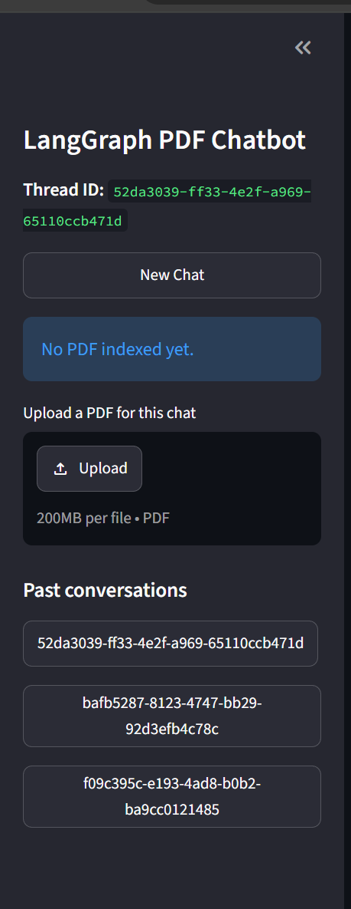
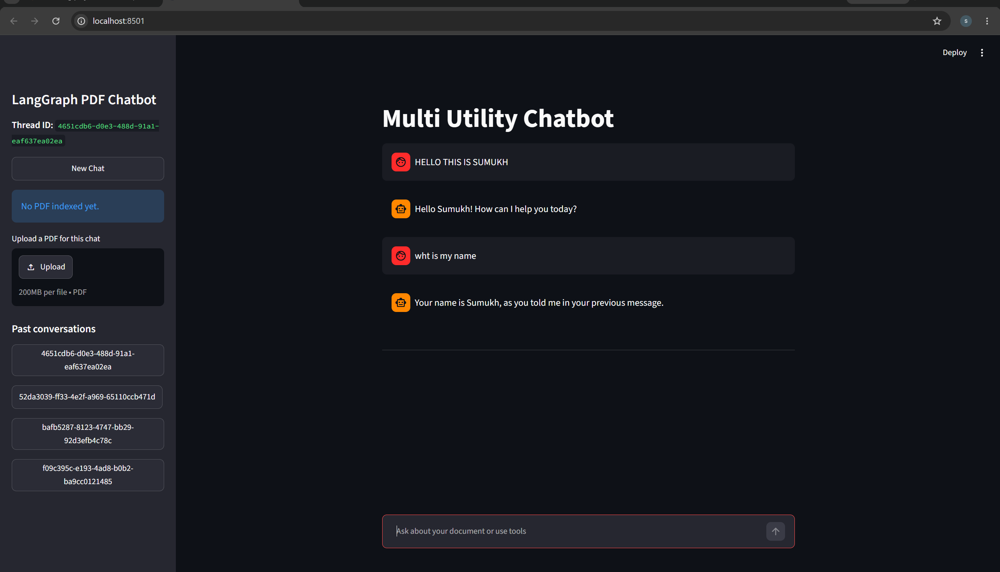

# Multi Utility Chatbot (LangGraph + Streamlit)

A multi-tool conversational assistant built with **LangGraph**, **Streamlit**, and **Google Gemini**. It supports PDF-based Q&A (RAG), web search, live stock prices, arithmetic calculations, persistent multi-thread chat history, and a sidebar to revisit past conversations.

---

## Screenshots

**Sidebar — new chat, PDF upload, thread history**



**Chat in action — Multi Utility Chatbot answering questions**



---

## Features

- **Conversational chat** powered by Google Gemini (`gemini-2.5-flash`) via LangGraph.
- **RAG over PDFs** — upload a PDF per chat thread; it's chunked, embedded, and indexed with FAISS so the bot can answer questions about it.
- **Tool calling**
  - `rag_tool` — retrieves relevant chunks from the uploaded PDF.
  - `DuckDuckGoSearchRun` — general web search.
  - `get_stock_price` — live stock quotes via Alpha Vantage.
  - `calculator` — add / subtract / multiply / divide.
- **Persistent threads** — conversations are checkpointed to a local SQLite database (`chatbot.db`), so you can switch between past chats without losing history.
- **Streaming responses** in the Streamlit UI, with a status indicator while a tool is running.

---

## Tech Stack

| Layer        | Technology                                   |
|--------------|-----------------------------------------------|
| UI           | Streamlit                                     |
| Orchestration| LangGraph (`StateGraph`, `ToolNode`)          |
| LLM          | Google Gemini (`langchain-google-genai`)      |
| Embeddings   | Gemini `embedding-001`                        |
| Vector store | FAISS                                         |
| PDF parsing  | `PyPDFLoader` (langchain-community)           |
| Persistence  | SQLite (`SqliteSaver` checkpointer)           |
| Web search   | DuckDuckGo (`langchain-community`)            |

---

## Project Structure

```
CHATGPT-2.O-main/
├── FINAL_BACKEND.py          # LangGraph graph, tools, PDF ingestion, checkpointer
├── FINAL_FRONTEND.py         # Streamlit UI (main entry point)
├── requirements.txt          # Python dependencies
├── chatbot.db                # SQLite checkpoint store (auto-generated)
├── IMAGES/                   # Screenshots used in this README
│   ├── 1.png
│   └── 2.png
└── WORKflow/                 # Earlier iterations / experiments
    ├── langgraph_backend.py
    ├── streamlit_frontend.py
    ├── streamlit_frontend_streaming.py
    ├── streamlit_frontend_threading.py
    ├── Z1_langgraph_database_backend.py
    ├── Z1_streamlit_database_frontend.py
    ├── Z2_langgraph_tools_backend.py
    ├── Z2_streamlit_tools_frontend.py
    └── chatbot.db
```

`FINAL_BACKEND.py` and `FINAL_FRONTEND.py` are the current, working version of the app. The `WORKflow/` folder contains earlier prototypes kept for reference.

---

## Getting Started

### 1. Clone the repository

```bash
git clone https://github.com/sumukh-m-gowda/RAG-Document-Assistant.git
cd RAG-Document-Assistant
```

### 2. Create a virtual environment

```bash
python -m venv .venv
# Windows
.venv\Scripts\activate
# macOS / Linux
source .venv/bin/activate
```

### 3. Install dependencies

> **Note:** `requirements.txt` in this repo currently only lists a subset of packages. Install the full set the app actually imports:

```bash
pip install langgraph langchain-google-genai langchain-community langchain-text-splitters langchain-core streamlit python-dotenv faiss-cpu pypdf requests duckduckgo-search
```

### 4. Set up environment variables

Create a `.env` file in the project root:

```
GEMINI_API_KEY=your_google_gemini_api_key_here
```

### 5. Run the app

```bash
streamlit run FINAL_BACKEND.py
```

Wait — actually run the **frontend**, since that's the Streamlit entry point:

```bash
streamlit run FINAL_FRONTEND.py
```

The app will open at `http://localhost:8501`.

---

## Usage

1. Start a new chat from the sidebar, or continue a past one by clicking its thread ID.
2. Optionally upload a PDF for the current thread — the bot will index it and can then answer questions about its content.
3. Ask questions in the chat box. The bot automatically decides whether to answer directly or call a tool (PDF search, web search, stock price, calculator).
4. Switch between conversations anytime — history is preserved via the SQLite checkpointer.

---

## Notes

- `get_stock_price` uses a hardcoded Alpha Vantage demo API key in `FINAL_BACKEND.py` — replace it with your own key for reliable results.
- The FAISS retriever for uploaded PDFs is stored in memory (`_THREAD_RETRIEVERS`), so indexed documents are lost on app restart, even though chat history persists in SQLite.

---

## License

Add a license of your choice (MIT, Apache 2.0, etc.) if you plan to share this publicly.
